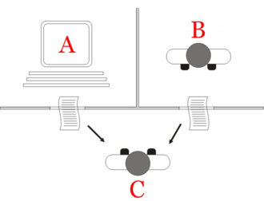

La Inteligencia Artificial, más conocida como AI por sus siglas en inglés, es un campo de estudio que se ha venido desarollando por oleadas los últimos 70 años. Sin embargo, este nuevo campo de la ciencia tiene como fundamentos ideas y técnicas tomadas de otros campos de estudio lárgamente establecidos. Estos otros campos son la filosofía; tomando las ideas de razón, lógica y mente; las matemáticas, la cuál aportó teorías sobre la lógica, deducción e inducción, probabilidad, toma de decisiones y cálculo; la psicología, la linguística y la ciencia computacional [@aimodern].

\setlength\parskip{5ex}
**Nacimiento, primera oleada expansiva y primer invierno**

El nacimiento de la inteligencia artificial se puede datar a principios de la década de 1950, en la cual los científicos de la época empezaron a plantearse por primera vez la posibilidad de crear máquinas que pensaran. En este sentido, se empezaron a plantear la idea de crear un cerebro artificial. Este primer periodo de la inteligencia artificial culminará el año 1956 con la conferencia de Dartmouth la cual se puede considerar el nacimiento de la IA al reunir a 11 matemáticos y científicos en lo fué una gran lluvia de ideas alrededor del campo [@Dartmouth_workshop].

\setlength\parskip{5ex}
En este sentido destaca, por ejemplo, la aportación que hizo Alan Turing en la década de los 50. Turing escribió un artículo en el cual especulaba con la posibilidad de crear máquinas que "pensaran". En este sentido se dió cuenta de que "pensar" era un concepto difícil de definir y por ello creó su famoso Test de Turing. Éste era una prueba de la habilidad de una máquina de mostrar un comportamiento inteligente, equivalente o indistiguible, del comportamiento inteligente de un humano. La imagen siguiente ilustra el Test de Turing.

\centering
{width=300px height=200}
\centering
  \captionof{figure}{Diagrama del Test de Turing}
  
\setlength\parskip{5ex}
\justifying
El Test de Turing consiste básicamente en que el agente C, el interrogador, tiene la tarea de intentar descubrir cuál de los dos interrogados es una máquina, basándose sólamente en respuestas escritas a ciertas preguntas. Si el interrogador no es capaz de distinguir cuál de los dos agentes, A o B, es la máquina, se dice que esta máquina ha pasado el test ya que es capaz de generar respuestas que son muy parecidas a las respuestas que daría un humano. La idea que tenía Turing es que si la máquina es capaz de pasar el test entonces es razonable afirmar que la máquina estaba "pensando", al ser sus respuestas indistinguibles a las que daría un humano.

La época que siguió a la conferencia de Dartmouth 1956 fue una era de descubrimientos en el nuevo campo recién creado. Se desarrollaron los primeros programas capaces de demostrar teoremas de geometría y aprender los primeros idiomas como el Inglés. Sin embargo esta etapa de desarrollo de los primeros programas de inteligencia artificial llegó a su fin a mediados de los años 1970s. La limitada capacidad computacional y potencia de procesamiento de las máquinas de la época dificultó que la expansión continuara, al ser el límite material a las ideas de la época. Pese a que las limitaciones computacionales fueron el principal impedimento para que esta primera ola de desarrollo de la IA continuara, otros problemas derivados como la pérdida de la financiación obtenida durante la primera expansión o las críticas recibidas por parte de otros científicos de distintos campos, como la filosofía, contribuyeron a la finalización de esta primera etapa de expansión [@aimodern].

**Segunda oleada**

La segunda oleada la podemos ubicar en los años 1980s. Esta etapa está definida por tener a los **sistemas expertos** como centro gravitatorio. A principios de los años 80 este tipo de programas de inteligencia artificial se empezaron a utilizar a nivel empresarial y se popularizaron. Un sistema experto es un tipo de programa de inteligencia artificial que resuelve cuestiones o problemas relacionados con un campo de conocimiento muy específico, basándose en normas y reglas lógicas derivadas del conocimiento de los expertos en esa materia. Este tipo de programas intentan emular el comportamiento de tendría un experto en un determinado campo de estudio al intentar resolver el problema. Intentan crear, en definitiva, poder computacional "inteligente" que permita suplir al poder cerebral humano [@expertsystems]. En este sentido fueron los primeros programas de inteligencia artificial que se podían considerar útiles al tener un diseño relativamente sencillo cuyo mantenimiento y desarrollo era relativamente asequible. El alza de los sistemas expertos puso en el centro de la inteligencia artificial el concepto de **conocimiento** y empezaron a plantearse la idea de que la inteligencia podía derivarse del uso intensivo de una gran fuente de conocimiento y la capacidad de utilizarlo e interconectarlo de distintas maneras [@aimodern].

Fue llegados a este punto, con el auge de los sistemas expertos, cuando aparecieron las primeras aplicaciones en el mundo de las financias utilizando este tipo de sistemas computacionales. Uno de los primeros programas que se propuso en el campo de la predicción financiera fue el sistema experto llamado Protrader. Este sistema, desarrollado por Ting-peng Lian y K.C Chen, fue capaz de precedir 87 puntos de caída del índice Dow Jones Industrial Average en 1986. Sus funciones principales eran las de determinar una estrategia de inversión óptima, ejecutar transacciones cuando eran necesarias y modificar la base de su conocimiento mediante un mecanismo de aprendizaje. En la figura 3.2 se puede observar un esquema de la arquitectura que tenía este sistema experto. Más detalles pueden ser encontrados en [@protrader].

\centering
{width=400px height=300}
\centering
  \captionof{figure}{Esquema de funcionamiento de Protrader. Fuente: Chen, Liang (1989). Protrader: an Expert System for Program Trading}

\setlength\parskip{5ex}
\justifying
En esta época otro tipo de aplicaciones financieras de los sistemas expertos se desarrollaron. Podemos encontrar programas en el campo de la auditoría, así como en el de la planificación financiera o los planes de inversión, ahorro y jubilación. A su vez se empezó a explorar la posibilidad de utilizar la inteligencia artificial en el campo de la detección del fraude, especialmente en la decada de 1990. Uno de los programas que fue patrocinado por el departamento del tesoro de Estados Unidos se llamaba FinCEN Artificial Intelligence system (FAIS). Este sistema se puso en funcionamiento en el año 1993 se podía utilizar para determinar casos de blanqueo de capitales[@FinCENblanqueo]. En el diagrama 3.3 se muestra la arquitectura del FAIS. Este sistema era capaz de realizar más de 200.000 transacciones por semana, en una época en la que las transacciones eran transcritas a mano. Por más de dos años el FAIS fue utilizado para detectar 400 casos potenciales de blanqueo de capitales por un total de 1$ billón [@FinCENblanqueo].

\centering
{width=400px height=400}

\centering
  \captionof{figure}{Esquema de funcionamiento del FAIS. Informe de la AAAI sobre FinCEN FAIS (1995)}

\setlength\parskip{5ex}
\justifying

**Tercera oleada y actualidad**

La tercera expansión de la inteligencia artificial es la que estamos viviendo hoy en día. Empezó a principio de la década de los 90 con la unión de la inteligencia artificial con ideas económicas. La definición de agente racional proveniente de la teoría de la decisión casó con ideas de la ciencia computacional y apareció la definición de agente inteligente. Los agentes inteligentes son sistemas que perciben el entorno en el que están y toman acciones que maximizan sus probabilidades de éxito. Son programas que vehiculan su actividad en base a la obtención de objetivos dentro de un entorno concreto. Otro ejemplo de los programas desarrollados a principios de los 90 es el sistema conocido como Deep Blue, que fue el primer ordenador entrenado para jugar al ajedrez que pudo batir al campeón mundial de ajedrez, Garry Kasparov [@pamelamachines].

Estos avances a principios de la década de los 90 facilitaron la enorme expansión de la inteligencia artificial a principio del siglo 21. La situación actual está dominada por el incremento en la potencia computacional de los ordenadores, que permite procesar una cantidad muy elavada de información de distintos tipos (Big Data), así como la utilización de técnicas avanzadas de aprendizaje automático aplicadas de manera exitosa en distintos campos de negocio. Es indudable que la inteligencia artificial forma parte de nuestra vida diaria ya que sus distintas aplicaciones se pueden apreciar de manera clara en la sociedad de hoy en día. En general, los campos exitosos que se están desarrollando en la actualidad son los siguientes:

*Deep Learning: Es un campo del machine learning que permite modelar altos niveles de abstracción en los datos con la construcción de redes neuronales más complejas. Los campos más desarrollados dentro del deep learning son las redes convolucionales profundas y las redes neuronales recurrentes (como las Long Short Term Memory). Su implantación en el mundo real es más que notoria ya que se utilizan de una manera satisfactoria, por ejemplo, en problemas de reconocimiento de imágenes.

*Big Data: El término Big Data hace referencia al tipo de información que no puede ser capturada, tratada y procesada con los medios de software tradicionales, por lo que es necesario un nuevo paradigma para el tratamiento de este tipo de datos. A los datos Big Data se los suele caracterizar con 5 V's (aunque se pueden encontrar artículos que postulan incluso 8). Éstas son: Volúmen, Velocidad, Variedad, Valor y Veracidad. La V de volúmen hace referencia al tamaño de los datos Big Data, que suele alcanzar magnitudes superiores al TeraByte de capacidad. La Velocidad hace referencia a la alta frecuencia de generación de este tipo de datos, que junto con su elevado volúmen, hace necesaria una nueva manera de capturar estos datos de una manera frecuente y rápida. Variedad hace referencia al hecho de tener distintos tipos de información, todos ellos relevantes. Desde datos en formato tabular hasta imágenes o secuencias de texto. Valor hace referencia al hecho de que sean datos capaces de ayudar a solventar un problema y aportar valor añadido. Por último, la V de veracidad hace referencia al hecho de que sean datos en los que realmente se puedan basar ciertas conclusiones.

\setlength\parskip{5ex}
\justifying
La figura 3.4 que se muestra a continuación permite obtener una visión más general de la situación en la que se encuentra la inteligencia artificial actualmente. El gran volúmen de datos disponibles para ser tratados junto con el aumento de la capacidad computacional han permitido tal evolución que se han desarrollado distintas ramas dentro del mismo. El campo de la inteligencia artificial se puede definir hoy en día como aquél dedicado a desarrollar sistemas computacionales capaces de llevar a cabo tareas que tradicionalmente requerían inteligencia humana para ser llevadas a cabo [@AIboard]. El campo dentro del marco de la inteligencia artificial que más se está desarrollado es el llamado Machine Learning o aprendizaje automático. Se puede definir como el conjunto de métodos y algoritmos los cuales se optimizan a través de la experiencia con intervención limitada o inexistente de un agente humano [@AIboard, @machinelearning]. Estas técnicas, mezcladas con las procedentes del campo del Big Data y el tratamiento masivo de datos, se utilizan para extraer información de valor de conjuntos de datos muy grandes y que suelen incorporar formatos no tabulares de información.

\centering
{width=450px height=250}
\centering
  \captionof{figure}{Esquema AI. Fuente: Artificial intelligence and machine learning in financial services. Financial Stability Board (FSB) 2017}

\setlength\parskip{5ex}
\justifying

En el mundo actual se pueden encontrar múltiples aplicaciones de inteligencia artificial y modelos de machine learning. En este sentido las empresas llamadas "fintech" ya se encuentran totalmente implantadas en la sociedad actual. Esto es así debido a que son empresas que prestan servicios financieros de una manera más dinámica que el sector bancario o financiero tradicional, apoyándose en las nuevas tecnologías y paradigmas de los sistemas de información de la actualidad. Así mismo, estas empresas están ejerciendo un efecto dinamizador en cuanto al desarrollo y digitalización de los sectores bancarios y financieros más tradicionales. España contaba a finales de 2017 con 300 Fintech y ocupaba la sexta posición en el mundo por número de compañías en el sector. Un informe elaborado por KPMG confirma que el modelo de negocio mayoritario de las Fintech nacionales es el de préstamos (21%), seguido del sector de pagos (19%) y el de inversión (16%) [@KPMG].

poner aqui todos los use case que haya hoy en día en los diferentes ambitos de los servicios financieros