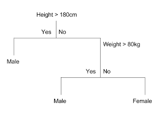
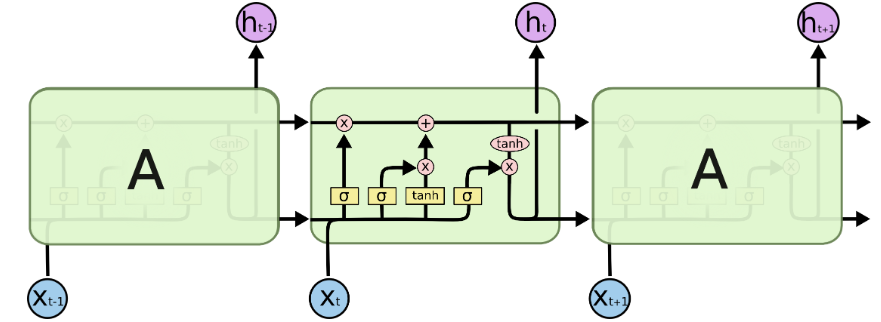
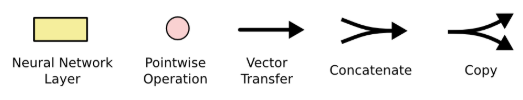

**Random Forest**

\noindent
Los árboles de decisión CART, llamados así por su nombre en inglés `Classification and Regression Trees`, son un tipo de modelos que se pueden utilizar para distintos tipos de aplicaciones de aprendizaje automático. En resumidas palabras, el método consiste en partir los datos a partir de un valor de cierta variable. Cada nodo padre genera 2 nodos hijos al tratarse de un problema de clasificación donde la variable respuesta tiene 2 clases. Esta partición se hace a partir de un criterio de impureza de los datos de manera que los nodos finales, llamados hojas, tengan la mayor pureza posible. Sin embargo los árboles que se hacen crecer de una manera muy profunda, es decir árboles muy grandes en cuanto al número de *split* y la profundidad que cogen, para aprender patrones altamente irregulares tienden a sobreajustar los datos de entrenamiento (problema conocido en inglés como *overfitting*). Un ligero ruido en los datos puede causar que el árbol crezca de una manera completamente diferente [@saha2016 p. 7]. Esto se debe al hecho de que los árboles de decisión tienen poco sesgo pero una alta varianza, al hacer pocas asumpciones sobre la variable respuesta (sesgo) pero altamente susceptibles a las variables predictoras (varianza). En otras palabras, un árbol de decisión casi no hace asumpciones sobre la variable objetivo (sesgo pequeño) pero es altamente susceptible a variaciones de los datos que se utilizan como input (alta varianza). Seguidamente se muestra una ejemplo sencillo de cómo un árbol de decisión luce. Esta imagen representa el ejemplo en el que se quiere predecir el género de una persona a partir de se altura y su peso.

\centering

\centering
  \captionof{figure}{Ejemplo de árbol de decisión. Fuente: Classification And Regression Trees for Machine Learning. Jason Brownlee, 2016}
  
\setlength\parskip{5ex}
\justifying
\noindent
En este punto es cuando aparece el modelo de aprendizaje automático llamado `Random Forest`. Este tipo de modelos superan el problema explicado en el párrafo anterior entrenando múltiples árboles de decisión en un subespacio del espacio formado por las variables predictoras/explicativas, asumiendo como coste un ligero incremento del sesgo. Esto significa que ninguno de los árboles del bosque es entrenado con la totalidad de los datos de entrenamiento. Los datos son recursivamente partidos en particiones, de manera que en un nodo particular la partición se elabora haciendo una "pregunta" a una de las variables. Por ejemplo, una partición podría estar hecha "preguntándole" a la variable *Rate of Change 1 day* cuántos datos tienen un valor superior/inferior a un cierto valor X. La elección del criterio de partición de los datos se basa en alguna medida de impureza tales como la Entropía de Shannon o la medida de impureza de Gini. En el presente trabajo se utiliza la función `randomForest` implementada en el paquete de R con el mismo nombre. Esta función utiliza como medida de impureza a partir de la cual se particionan los datos el índice de impureza de Gini [@RF]. Este índice se utiliza como la función para medir la calidad de cada partición en cada nodo. La impureza de Gini en el nodo N se calcula a partir de la fórmula siguiente:

$$g(N)=\sum_{i\neq j}P(w_i)P(w_j)$$

\noindent
Dónde $P(w_i)$ es la proporción de casos donde la variable respuesta toma la clase i. $P(w_j)$ entonces es la propoción de casos en los cuales la variable respuesta toma la clase j.

\noindent
La manera heurística para escoger la mejor decisión de particion en un nodo específico se basa en el hecho de conseguir la mayor reducción posible de impureza. Es decir, la mejor partición posible en un determinado nodo viene definida por la mayor ganancia de información (variable que mejor particiona los datos / inclye más observaciones en cada partición) o por la mayor reducción de impureza. La ganancia de información que genera una determinada partición se puede calcular con la fórmula siguiente:

$$\bigtriangleup I(N) = I(N) - P_L * I(N_L) - P_R*I(N_L)$$

\noindent
Dónde $I(N)$ es la medida de impureza (ya sea la impureza de Gini o la entropía de Shannon) de un nodo $N$. $P_L$ es la proporción de casos que en el nodo padre $N$ van a parar al hijo **izquierdo**. De un modo similar, $P_R$ representa la proporción de casos en el nodo padre $N$ que se van a parar al nodo hijo **derecho** después de realizar la partición. $N_L$ y $N_R$ son los nodos hijos izquierdo y derecho, respectivamente.

\setlength\parskip{7ex}
\noindent
Este tipo de modelos de aprendizaje automático son conocidos como modelos *ensemble*. En el núcleo de estos modelos está el *Bootstrap aggregating*, mayormente conocido como *bagging*. Esto significa que la predicción final se calcula como una media de la solución obtenida con cada árbol construido sobre cada remuestra generada con la técnica no paramétrica del *bootstrap*. En otras palabras: utilizando *bootstrap* se calculan remuestras de los datos con las cuales se contruye un árbol. Dentro de cada árbol calculado sobre cada remuestra *bootstrap* cada nodo es partido utilizando la mejor variable dentro de la muestra de variables escogidas aleatoriamente en cada nodo. Al final, la predicción del modelo es una media de los valores obtenidos con todos estos árboles calculados sobre las distintas remuestras *bootstrap* (véase [@RF] p. 18 y [@ensemble]). El método *bagging* mejora la estabilidad y la precisión de los algoritmos de aprendizaje. Al mismo tiempo reduce la varianza y el sobreajuste, los cuales son un problema relativamente común al construir árboles de decisión CART [véase @saha2016 p. 8 para un resumen del algoritmo escrito en pseudocódigo].

\setlength\parskip{7ex}
**Modelos en h2o: AutoML**

\noindent
En el apartado V.3 del presente trabajo se utiliza la función `AutoML` del paquete `h2o` para hacer un análisis automático sobre el modelo conceptual de predicción de la dirección de movimiento del precio de cierre. Los modelos que esta función prueba son los siguientes:

i) *Distributed Random Forest*. Este tipo de modelos incluyen tanto los modelos Random Forest descritos en el presente apartado como los modelos llamados Extremely Randomized Trees (Árboles aleatorizados de manera extrema). La diferencia entre este tipo de modelos (XRT) y los modelos Random Forest clásicos es que se añade otra capa de aleatoriedad en la manera en la que las particiones en cada nodo se calcula. Como en los Random Forest, se utiliza un subconjuto aleatorio de variables predictoras como candidatas en cada partición pero en vez de buscar el umbral que mejor discrimina (o parte) la base de datos, el umbral se construye aleatoriamente para cada variable candidata y el mejor de estos umbrales generados aleatoriamente se coge como la regla de partición. Esto normalmente permite reducir un poco más la varianza del modelo a expensas de un ligero incremento en el sesgo.

ii) *Generalized Linear Models*. Este tipo de modelos es ampliamente conocido. En este caso, al tratarse de un problema de clasificación, el modelo lineal generalizado que se prueba con la función `AutoML` es una regresión logística con variable respuesta binaria.

iii) *Extreme Gradient Boosting (Gradient Boosting Machine)*. Este tipo de modelos son considerados como modelos *ensemble*. Consiste en construir árboles de clasificación de manera paralelizada para después hacer un *ensemble* de ellos. Son en esencia modelos que se construyen por árboles de clasificación, cada uno construido con computación en paralelo.

iv) *DeepLearning (Fully-connected multi-layer artificial neural network)*.  El modelo de deep learning que aplica el paquete *h2o* está basado en una *multi-layer feedforward artificial neural network* que se entrena utilizando el método de optimización llamado *stochastic gradient descent* utilizando *back-propagation*.

v) *Stacked Ensemble*. El objetivo de los modelos *ensemble* de machine learning es el de utilizar distintos modelos de aprendizaje automático para obtener un rendimiento mayor en cuanto a capacidad predictiva que la que podría obtener ninguno de los modelos individuales por si solo. De hecho, muchos de los modelos actuales de machine learning que se han vuelto populares son modelos *ensemble*. Por ejemplo el mismo modelo Random Forest o las máquinas de gradientes potenciadas (Gradient Boosting Machine) son modelos *ensemble* que utilizan métodos distintos para hacer este *ensemble*. Los modelos Random Forest utilizan el método *bagging (bootstrap aggregating)* mientras que los GBM utilizan el método del *boosting*. Lo que permiten estos métodos es el coger un grupo de modelos más "débiles" (por ejemplo los árboles de decisión) para crear un único modelo más potente.

\setlength\parskip{5ex}

**Long-Short Term Memory Recurrent Neural Network (LSTM)**

\noindent
Este tipo de redes neuronales recurrentes, llamadas simplemente LSTM, permiten resolver el problema que se planta con las redes neuronales recurrentes tradicionales en cuanto a las dependencias temporales alejadas en el tiempo. Las redes tradicionales presentan el inconveniente de que no son capaces de recordar largas dependencias temporales. Este tipo de redes, las LSTM, fueron introducidas por Hochreiter & Schmidhuber en 1997 y permiten solventar el problema de las dependencias temporales grandes al permitir recordar información durante largos periodos de tiempo. Para ayudar a la explicación de cómo funcionan este tipo de redes neuronales se utilizan los gráficos creados por [@LSTMteoria], que utilizan una ilustración muy clara que permite una explicación intuitiva de este tipo de modelos sin centrarse totalmente en la formalidad matemática.

\noindent
En primer lugar se presenta el esquema básico de una RNN LSTM. Como todas las redes neuronales recurrentes se puede representar el esquema como una cadena de módulos de red neuronal. La diferencia entre las RNN clásicas y las LSTM es que su estructura interna es diferente ya que tienen 4 redes neuronales internas en cada módulo en vez de una simple capa.

{width=600px height=300}
{width=500px height=80}
\centering
  \captionof{figure}{Estructura general de una red neuronal recurrente LSTM. Fuente: (Olah, 2015)}

\setlength\parskip{5ex}
\justifying
\noindent
La idea fundamental de este tipo de redes neuronales radica en el llamado *cell state* que en este caso está representado con la línea que recorre la parte superior de la figura IV.3. Este *cell state* es el flujo de datos entre el módulo previo de la LSTM y el módulo siguiente, y se ve afectado por la red LSTM que quita o añde información a este flujo regulando este proceso a través de las estructuras llamadas puertas o *gates*. Estas puertas son redes neuronales que deciden que cantidad de información previa va a afectar a este flujo de datos o *cell state*. Un módulo de LSTM tiene 4 puertas: 3 sigmoidales, que se encargan de decidir que porcentage de información se mantiene y cuánto se olvida y una tanh que transforma el rango de los valores entre -1 y 1.

{width=425px height=200}
\centering
  \captionof{figure}{Cell state. Cantidad de información que fluye a través de un módulo de la LSTM. Fuente: (Olah, 2015)}

\setlength\parskip{5ex}
\justifying

#### Primer paso

\noindent
El primer paso en la LSTM es decidir que información de $C_{t-1}$ se olvida, basado en $h_{t-1}$ y $x_t$. A esta puerta se la conoce como la "puerta del olvido" y el proceso se elabora a través de una capa sigmoidal, que decide qué partes de la información de $C_{t-1}$ hay que olvidar. Esta capa utiliza $h_{t-1}$ y $x_t$ para sacar como output un valor entre 0 y 1 por cada número en el *cell state* $C_{t-1}$. Un 1 representa "recuerda totalmente este elemento" mientras que un 0 representa "olvida totalmente este elemento".

\centering
{width=600px height=190}
$$f_t=\sigma \ (W_f \ \cdot \ [h_{t-1} \ , \ x_t] + b_f)$$
\centering
  \captionof{figure}{Primer paso o puerta en la LSTM. Fuente: (Olah, 2015)}

\setlength\parskip{5ex}
\justifying

#### Segundo paso

\noindent
En el segundo paso se decide qué nueva información se procede a guardar en el *cell state*. En primer lugar se encuentra una capa sigmoidal llamada la "puerta de entrada" o "*input gate layer*" que decide qué valores se procede a actualizar. A continuación una capa con la función **tanh** crea un vector con los nuevos valores candidatos $\tilde{C_{t}}$ que pyede ser añadido al *cell state*. En otras palabras el proceso que tiene lugar en el segundo paso es el de decidir que valores se van a actualizar y con que valor concreto lo van a hacer. En el tercer paso se combinan estas dos puertas o capas para actualizar el *cell state*.

\centering
{width=600px height=210}
$$i_t = \sigma \ (W_i \ \cdot \ [h_{t-1} \ , \ x_t] + b_i)$$
$$\tilde{C}_t = tanh \ (W_C \ \cdot \ [h_{t-1} \ , \ x_t] + b_C)$$

\centering
  \captionof{figure}{Segundo paso en la LSTM. Puertas 2 y 3. Fuente: (Olah, 2015)}

\setlength\parskip{7ex}
\justifying

#### Tercer paso

\noindent
El tercer paso consiste en actualizar el antiguo *cell state*, o $C_{t-1}$. En los pasos 1 y 2 ya se ha decidido qué información olvidar y qué valores actualizar, junto con el valor concreto que deben tener. Queda por tanto el trabajo de aplicar dichos cambios. Se multiplica el antiguo $C_{t-1}$ por $f_t$, olvidando las partes que se ha decidido previamente olvidar. Posteriormente se añade $i_t * \tilde{C_{t}}$, lo que crea los nuevos valores candidatos escalador por el valor que indica cuánto se ha decidio actualizar cada valor del *cell state*.

\centering
{width=600px height=200}
$$C_t = f_t * C_{t-1} + i_t * \tilde{C}_t$$

\centering
  \captionof{figure}{Tercer paso en la LSTM. Aplicación de las puertas 1, 2 y 3. Fuente: (Olah, 2015)}

\setlength\parskip{5ex}
\justifying

#### Cuarto paso

\noindent
El cuarto y último paso consiste en decidir qué se va a generar como *output*. Este *output* o resultado estará basado en el *cell state* pero será una versión filtrada del mismo. En primer lugar se utiliza una capa sigmoidal la cual decide qué partes del *cell state* se sacarán como *output*. Posteriormente se hace pasar el *cell state* a través de una capa **tanh** para transformar los valores y ponerlos entre -1 y 1 y se multiplican por el *output* de la capa sigmoidal, de manera que sólo se sacan como *output* las partes que se deciden. De hecho, el proceso de multiplicar la cantidad de memoria presente en el flujo que es seleccionada por la capa **tanh** por la capa sigmoidal está definiendo el volúmen de información que sale de la LSTM como output hacia el siguiente módulo.

\centering
{width=600px height=270}
$$o_t = \sigma \ (W_o \ \cdot \ [h_{t-1} \ , \ x_t] + b_o)$$
$$h_t=o_t * tanh(C_t)$$

\centering
  \captionof{figure}{Cuarto y último paso en la LSTM. Elección de la salida de la LSTM. Fuente: (Olah, 2015)}

\setlength\parskip{5ex}
\justifying
\noindent
Finalmente cabe comentar que se construye una LSTM de tipo *STATEFULL*. Esto significa que todos los estados de la red son propagados al siguiente *batch*, de manera que no existe un proceso de barajado interno sino que el estado de la muesta $X_i$ será utilizado en la computación de la muestra $X_{i+bs}$ donde $bs$ es el tamaño del *batch*.

\setlength\parskip{8ex}