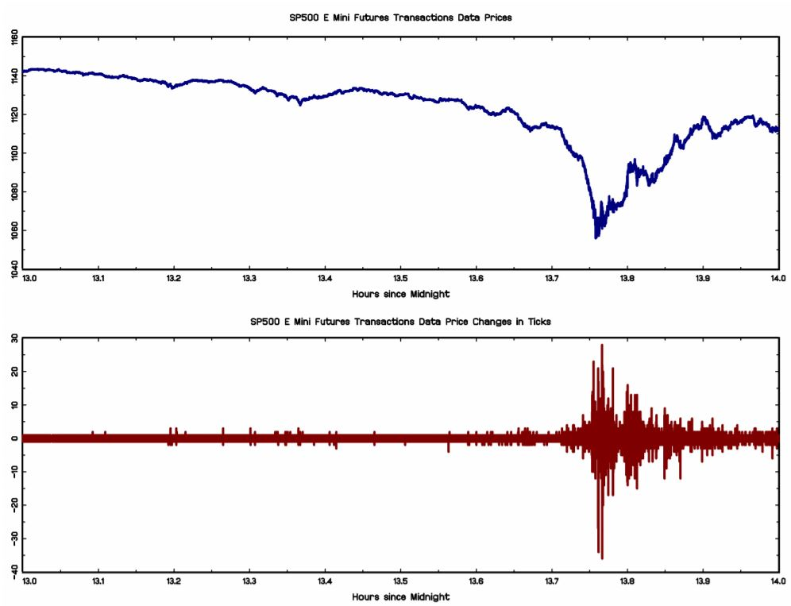

**Inversión y trading algorítmico**

\noindent
Otro de los campos en los que se aplica actualmente la IA es en el del *trading algorítmico*. Estos sistemas de machine learning son entrenados con información de grandes bases de datos relacionadas con las condiciones cambiantes del mercado en cuestión y el precio para extraer una decisión de inversión, compra o venta de una posición, y colocarla en el mercado. Aquí entra en juego de nuevo el gran potencial del big data y el machine learning a la hora de procesar un gran volúmen de información de una manera muy rápida, potencialmente en tiempo real. Estos algoritmos están constantemente analizando el mercado y posteando acciones de compra o venta de una posición con una frecuencia muy elevada. Es a causa de la gran velocidad en las interacciones con el mercado generada con este tipo de sistemas que se los mercados tradicionales se están adaptando al llamado *High-Frequency Trading (HFT)*. El *trading* de alta frecuencia se soporta sobre este tipo de algoritmos de *trading* automático, que permiten alcanzar niveles donde el ser humano no sería nunca capaz de llegar ya que no podemos procesar tal cantidad de información de una manera tan rápida.

\setlength\parskip{5ex}
\noindent
Las consecuencias de la implantación de las transacciones bursátiles de alta fracuencia han sido tanto positivas y negativas. En primer lugar una de las principales consecuencias positivas de la aplicación del *trading* algorítmico y la creación del llamado HFT ya ha sido nombrada. Es el hecho de que las transacciones aumentan de velocidad. Al ser transacciones automatizadas que se hacen de una manera rápida en cuanto hay un cambio favorable en el mercado, también aumenta en consecuencia el número de transacciones totales que se realizan en ese mercado, a la par que disminuyen el número de transacciones con un mayor volúmen. En otras palabras, transacciones de menor volúmen y más rápidas. Otra de las consecuencias generales que se pueden apreciar es que el hecho de introducir HFT, y la algorítmica en general, en los mercados financieros de *trading* es que se ha reducido el coste de las transacciones. La razón es sencilla: es más asequible hacer *trading* o negociación bursátil con máquinas que con humanos, ya que las primeras tienes ciertos beneficios tales como no requerir días de vacaciones o no ponerse enfermos (entre otros). Es por eso que el coste el coste de las transacciones se ha venido reduciendo a medida que los mercados se han ido automatizando. El hecho de poder sustituir factor de trabajo humano por factor capital, al reproducir las tareas que anteriormente hacían los *brokers* o *traders*, tiene como consecuencia directa una reducción del coste de las transacciones. En tercer lugar, existen estudios que demuestran que la diferencia entre el precio de compra/oferta y de venta/demanda en un mercado financiero, también conocido como *bid-ask spread*, se ha reducido a causa de la implantación del HFT. Por consecuencia la liquidez, definida como el valor disponible para comprar y vender dentro del rango de precios Bid-Ask, se ha incrementado a lo largo del tiempo [@HFT p. 13]. Otra de las consecuencias positivas del HFT se puede encontrar en términos de estabilidad y predictibilidad de los mercados. Hay una gran evidencia que sugiere que la eficiencia del precio, en los mercados financieros, se ha incrementado generalmente con el crecimiento de las operaciones bursátiles basadas en computación [@HFT]. Se ha comprovado que los traders de HFT tienden a mover las operaciones en la dirección de los cambios de precios permanentes (eficientes, óptimos) y en la dirección opuesta a los precios transitorios erráticos [@HFTbank].

\setlength\parskip{5ex}
\noindent
Es totalmente cierto que, por otro lado, el hecho de incorporar las transacciones bursátiles de alta frecuencia en los mercados financieros ha traído, y puede provocar en el futuro, ciertas consecuencias no tan deseables. Uno de los principales argumentos que se esgrime en numerosos estudios en contra del HFT es que éste aumenta la volatilidad de los mercados, aludiendo al hecho de que la volatilidad es más elevada en mercados más rápidos. Además, al ser un sistema nuevo, es posible que este tipo de algoritmos, que unitariamente pueden ser estables, terminen funcionando de una manera inconsistente o muy inestable. Sin embargo, existen toda otra serie de estudios, analizados en detalle en [@AIboard] p.16, que ponen en evidencia una falta de eventos empíricos que soporten esta teoría. En general los datos no confirman el hecho de que el HFT haga que los mercados sean más volátiles. Otra de las consecuencias negativas que podrían tener graves implicaciones, especialmente en el futuro, es la que se puso de manifiesto el día 6 de Mayo de 2010 en el índice E-mini S&P 500  del mercado de futuros en EEUU. En esta fecha se produjo lo que se llamó un *Flash-Crash*, es decir, un evento intra-día de corta duración en la que se produce un desajuste profundo de los precios que no está generado por ningún cambio en el valor fundamental de los activos que se están comprando/vendiendo. En el caso del *Flash-Crash* del 2010, se ejecutranon en un corto plazo de tiempo muchos algoritmos de HFT con órdenes de venta, motivo por el cual el precio presentó una gran volatilidad durante unos minutos. La figura 3.5 muestra la trayectoria del precio de los futuros en este mercado durante el crash, así como los cambios en los precios entre transacciones consecutivas, medidos en ticks. Gracias a ella podemos observar la gran velocidad con la que cambió el precio y la increíble volatilidad durante este periodo. 

\centering
{width=750px height=500}
\centering
  \captionof{figure}{Nivel de precios de los futuros Emini durante el flash crash y cambios en los precios entre transacciones consecutivas. Fuente: Implications of high-frequency trading for security markets, Oliver Linton, Soheil Mahmoodzadeh 2018}

\justifying
\setlength\parskip{5ex}
\noindent
Una de las posibles causas de este *Flash-Crash* se encuentra detalladamente descrita en [@HFT]. En un informe de la SEC/CFTC (2010) se propone como punto inicial una gran orden de venta de 75000 contratos de futuros. Esto provocó que los algoritmos de trading automático empezaran a interactuar entre ellos tratando de absorver el gran volúmen. En general, este informe concluye que los traders de alta frecuencia no fueron los que desencadenaron el *Flash-Crash* pero fueron sus respuestas a la presión de venta inusual generada ese día, ejecutadas a gran velocidad, las que provocaron que la volatilidad del mercado se viera amplificada.

\setlength\parskip{5ex}
\noindent
Existen otros ejemplos de *Flash-Crashes* entre los que cabe destacar la comúnmente llamada "Pesadilla en Wall-Street" el 1 de Agosto de 2012. En este caso, la compañia Knight Capital perdió alrededor de 450 millones de dólares en unos pocos minutos a causa de un "error de *trading*" que provocó un un desajuste transversal en el NYSE. Otros ejemplos los podemos encontrar en los mercados de divisas. Es el caso del llamado *Sterling Flash Crash* ocurrido en 2016, donde el par GBP/USD, el tercero más líquido en el mundo, disminuyó el valor un 9.66% en 40 segundos [@HFT].

\setlength\parskip{5ex}
\noindent
En general, las transacciones bursátiles de alta frecuencia pueden mejorar la calidad de los mercados, generando mayor liquidez, reduciendo los márgenes entre precios de oferta y demanda (*bid-ask spread*) y aumentando la eficiencia. No obstante los beneficios que el HFT aporta pueden venir con una serie de costes asociados, como ya se ha destacado. La capacidad de estos sistemas automáticos de interactuar entre ellos de una manera autónoma incrementa el riesgo de que se produzcan eventos extremos que, aun siendo raros y excepcionales, se inician y desarrollan a velocidades muy elevadas. Estas situaciones generan grandes volúmenes de información que requieren largos periodos de tiempo para ser analizados antes de ser entendidos.

\setlength\parskip{5ex}

**Gestión de carteras**

\noindent
El uso de la inteligencia artificial y el machine learning en el sector de la gestión de carteras es considerablemente importante. Estas técnicas se utilizan para sacar provecho de la gran cantidad de datos disponibles en los mercados para identificar nuevas señales en los movimientos de los precios. Sin embargo, estas técnincas se fundamentan en los mismos principios que las técnincas analíticas que ya se utilizaban tradicionalmente. La idea es indentificar señales que permitan hacer predicciones relacionadas con los precios o la volatilidad de los *stocks* para generar rentabilidades más grandes y no correlacionadas. Especialmente se encuentra una gran implantación en los fondos *quant*, la mayoría de los cuales son fondos de cobertura. A su vez se pueden encontrar también ejemplos de compañías que utilizan técnicas de machine learning para recomendar a sus clientes estrategias de inversión personalizadas y automatizadas, de manera que se consigue un servicio personalizado ajustado a las necesidades específicas de cada cliente.
