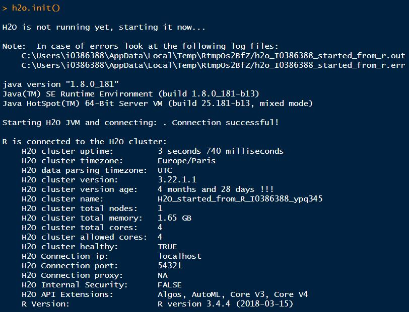

\noindent
En el siguiente apartado se procede a utilizar el paquete de R **h2o** para construir distintos modelos de machine learning. La compañía **h2o** es una organización fundamentada en el concepto de *open-source* y constituye un sistema preparado para la computación ML. Concretamente en este apartado se procede a utilizar la función `AutoML` que se incluye en este paquete. El procedimiento es el siguiente: se aplica la función autoML con el mismo perímetro que en el apartado V.1 pero reducido, es decir, sobre 1 de las 4 empresas que se toman como ejemplo (KO) y con los alisados utilizando una EMA y ventanas de predicción. Se limita la aplicación de este apartado a una de las 4 empresas tomadas como ejemplo a causa de las limitaciones computacionales que se tienen durante la escritura de la presente tesis. En esencia ambos apartados son lo mismo en tanto que aplican el mismo tipo de modelo conceptual (predicción de la dirección de movimiento del precio de cierre). La diferencia radica en el tipo de modelo que se aplica: mientras que en el apartado V.1 se prueba el modelo Random Forest básico, en este apartado se deja a la función `AutoML` probar todos los modelos que incluye (definidos en el apartado IV.1). El marco para este apartado es el mismo que en el apartado V.1 en cuanto a las empresas utilizadas como ejemplo, los alisados y ventanas de predicción y las particiones de muestra train y test.

\noindent
La función `AutoML` funciona de la siguiente manera. Con el objetivo de automatizar el proceso de entrenamiento de los modelos de machine learning de aprendizaje supervisado, se utilizan máquinas virtuales java para paralelizar el cálculo de los distintos modelos en los diferentes núcleos del ordenador con el que se lance, de manera que se prueba un modelo distinto de manera paralela. Una vez calculados todos los modelos se evalúan sobre la muestra de prueba y se elabora lo que los creadores del paquete llaman *leaderboard* o, lo que es lo mismo, una lista con los modelos que han obtenido un mejor rendimiento sobre la muestra de prueba. En el presente trabajo se construye una función que aplica la función `AutoML` para la base de datos y compañía que se deseen. Este función coge el **mejor** modelo, es decir, el modelo que queda primero en esta tabla de modelos con mejores rendimientos. El lector debe notar que, dependiendo de la compañía, tipo de alisado en los datos y ventana de predicción, el mejor modelo escogido puede ser distinto.

\noindent
En cuanto a los parámetros utilizados para lanzar la función `AutoML` se definen los siguientes. En primer lugar se fija una semilla para permitir la reproducibilidad de los resultados. También se define el parámetro `nfolds=0` para evitar la cross-validación ya que se desea mantener la estructura temporal de los datos. Además se limita el número máximo de modelos a probar a un número de 10 para agilizar el cálculo y se indica a la función que se quiere balancear la variable respuesta. En cuanto a las métricas con las que se evalúa el modelo se utiliza el AUC y la *accuracy*.

\noindent
Uno de los argumentos en contra de este tipo de funciones es que normalmente son funciones *black box* en el sentido que no muestran lo que están haciendo por dentro. Sin embargo, el objetivo de este apartado es doble: por un lado, el de aplicar distintos modelos de machine learning a los aplicados en el apartado V.1 del presente trabajo sobre el mismo modelo conceptual de predicción de la dirección de movimiento del precio de cierre y, por otro, el de mostrar que en el futuro el valor añadido no estará en el hecho de contruir manualmente los modelos (se está probando que se puede hacer automáticamente) sino más bien el de definir modelos conceptuales que tengan buena capacidad predictiva.

\noindent
En primer lugar se carga la librería y se inicializa el espacio de trabajo *h2o* con sus respectivas máquinas virtuales. El mensaje informativo sobre las características del clúster que se crea al inicializar la librería se muestran a continuación:

\setlength\parskip{5ex}
\centering

\centering
  \captionof{figure}{Información obtenida al inicializar el clúster h2o}
  
\setlength\parskip{5ex}
\justifying
\noindent
Como se puede apreciar en la figura anterior, entre la información que ofrece el paquete h2o ofrece inicializarse se encuentra el mensaje al arrancar las máquinas virtuales Java sobre las que trabaja, así como información relativa a la versión de los clústers que se están utilizando, el nombre, número de nodos y núcleos que se procede a utilizar, la memoria total y datos sobre la connectividad.

\noindent
Para facilitar la aplicación de la función `AutoML` de h2o se crea una función personalizada con 3 parámetros. Basta con introducir la muestra de entramiento y la muestra de prueba, así como un carácter con el nombre de la empresa (en este caso, combinación de empresa + alisado + ventana de predicción). Esta función devuelve un dataframe con las métricas AUC y *accuracy* (con umbral de 0.5) ya que son las métricas que se utilizan en el presente trabajo para evaluar los modelos de clasificación binaria SMD. A su vez también se incluye la etiqueta, o nombre, del modelo que mejor ha rendido sobre la muestra de entrenamiento de entre todos los que la función `AutoML` prueba. Esta función se puede encontrar en el anexo de esta testis, en el apartado V.3. 

\noindent
Seguidamente se presentan los resultados para todas las combinaciones de alisado y ventana de predicción sobre la empresa Coca-Cola CO, ordenados de mayor a menor AUC.

```{r}
library(kableExtra)
library(tidyverse)
library(caret)
library(stringi)
load("C:/Users/i0386388/Desktop/tesis/Tesis/h2o_SMD_results.RData")

kable(h2o.SMD.results %>% arrange(desc(AUC)), "latex") %>%
  kable_styling(font_size = 10,latex_options = c("basic"))
```
\centering
  \captionof{table}{Resultados modelo SMD aplicado a la empresa Coca-Cola KO utilizando automatic machine learning en h2o}
  
\setlength\parskip{5ex}
\justifying
\noindent
En general el resultado de los modelos es bueno. Por lo que respecta a la accuracy calculada con un umbral de 0.5 es en general superior al 50% de accuracy. A su vez, en obtienen unos AUC relativamente elevados. El paquete h2o ha demostrado ser efectivo en cuanto a la construcción de modelos con buen rendimiento. Todos menos un modelo aplicados sobre los datos de la empresa Coca Cola obtienen un AUC por encima de 0.85. En este caso el mayor AUC es de 0.96 y se obtiene con un Gradient Boosting Machine sobre los datos de Coca Cola alisados con una EMA a 60 días y prediciendo si el precio de cierre será más elevado o más bajo a 2 meses vista. Seguidamente aparecen los modelos sobre los datos alisados con EMA 90 días a 1 y 2 meses vista con AUC de 0.95 y 0.93 respectivamente. Los resultados obtenidos con el machine learning automático son sorprendentemente buenos en relación al AUC sobre muestra test. El hecho de que el rendimiento del modelo parezca mejor usando el AUC en vez de la accuracy se debe a que la métrica **accuracy** depende de un umbral predefinido (0.5), y posiblemente el umbral óptimo para los modelos definidos no sea el de 0.5.

En cuanto a los distintos modelos escogidos cabe destacar que en 5 de los 9 modelos escogidos para las 9 combinaciones de alisado y ventana de predicción ha sido la regresión logística, etiquetada en este caso como GLM_grid


\noindent
Finalmente se hace un ejercicio interesante, el de comparar la *accuracy* mostrada en la tabla anterior usando el paquete h2o con la accuracy de los mismos modelos construidos en el apartado V.1. En este caso los modelos son comparables al estar evaluados utilizando el mismo periodo de prueba.

```{r}
load("C:/Users/i0386388/Desktop/tesis/datasplit_testmodels.RData")

CM_KO_30_1m<-confusionMatrix(predict(model_KO_30_1m_target_feature,test_KO_30_1m_target_feature),test_KO_30_1m_target_feature$target)
CM_KO_60_1m<-confusionMatrix(predict(model_KO_60_1m_target_feature,test_KO_60_1m_target_feature),test_KO_60_1m_target_feature$target)
CM_KO_90_1m<-confusionMatrix(predict(model_KO_90_1m_target_feature,test_KO_90_1m_target_feature),test_KO_90_1m_target_feature$target)
CM_KO_fun_1m<-confusionMatrix(predict(model_KO_fun_1m_target_feature,test_KO_fun_1m_target_feature),test_KO_fun_1m_target_feature$target)


CM_KO_30_2m<-confusionMatrix(predict(model_KO_30_2m_target_feature,test_KO_30_2m_target_feature),test_KO_30_2m_target_feature$target)
CM_KO_60_2m<-confusionMatrix(predict(model_KO_60_2m_target_feature,test_KO_60_2m_target_feature),test_KO_60_2m_target_feature$target)
CM_KO_90_2m<-confusionMatrix(predict(model_KO_90_2m_target_feature,test_KO_90_2m_target_feature),test_KO_90_2m_target_feature$target)
CM_KO_fun_2m<-confusionMatrix(predict(model_KO_fun_2m_target_feature,test_KO_fun_2m_target_feature),test_KO_fun_2m_target_feature$target)

CM_KO_30_3m<-confusionMatrix(predict(model_KO_30_3m_target_feature,test_KO_30_3m_target_feature),test_KO_30_3m_target_feature$target)
CM_KO_60_3m<-confusionMatrix(predict(model_KO_60_3m_target_feature,test_KO_60_3m_target_feature),test_KO_60_3m_target_feature$target)
CM_KO_90_3m<-confusionMatrix(predict(model_KO_90_3m_target_feature,test_KO_90_3m_target_feature),test_KO_90_3m_target_feature$target)
CM_KO_fun_3m<-confusionMatrix(predict(model_KO_fun_3m_target_feature,test_KO_fun_3m_target_feature),test_KO_fun_3m_target_feature$target)


a<-data.frame(acc1m=as.numeric(c(round(CM_KO_30_1m$overall[1]*100,2),
                                    round(CM_KO_60_1m$overall[1]*100,2),
                                   round(CM_KO_90_1m$overall[1]*100,2),
                                   round(CM_KO_fun_1m$overall[1]*100,2))),
              sensi1m=as.numeric(c(round(CM_KO_30_1m$byClass[1]*100,2),
                                    round(CM_KO_60_1m$byClass[1]*100,2),
                                    round(CM_KO_90_1m$byClass[1]*100,2),
                                    round(CM_KO_fun_1m$byClass[1]*100,2))),
              speci1m=as.numeric(c(round(CM_KO_30_1m$byClass[2]*100,2),
                                    round(CM_KO_60_1m$byClass[2]*100,2),
                                    round(CM_KO_90_1m$byClass[2]*100,2),
                                    round(CM_KO_fun_1m$byClass[2]*100,2))),
              
              acc2m=as.numeric(c(round(CM_KO_30_2m$overall[1]*100,2),
                                    round(CM_KO_60_2m$overall[1]*100,2),
                                   round(CM_KO_90_2m$overall[1]*100,2),
                                   round(CM_KO_fun_2m$overall[1]*100,2))),
              sensi2m=as.numeric(c(round(CM_KO_30_2m$byClass[1]*100,2),
                                    round(CM_KO_60_2m$byClass[1]*100,2),
                                    round(CM_KO_90_2m$byClass[1]*100,2),
                                    round(CM_KO_fun_2m$byClass[1]*100,2))),
              speci2m=as.numeric(c(round(CM_KO_30_2m$byClass[2]*100,2),
                                    round(CM_KO_60_2m$byClass[2]*100,2),
                                    round(CM_KO_90_2m$byClass[2]*100,2),
                                    round(CM_KO_fun_2m$byClass[2]*100,2))),
              
              acc3m=as.numeric(c(round(CM_KO_30_3m$overall[1]*100,2),
                                    round(CM_KO_60_3m$overall[1]*100,2),
                                   round(CM_KO_90_3m$overall[1]*100,2),
                                   round(CM_KO_fun_3m$overall[1]*100,2))),
              sensi3m=as.numeric(c(round(CM_KO_30_3m$byClass[1]*100,2),
                                    round(CM_KO_60_3m$byClass[1]*100,2),
                                    round(CM_KO_90_3m$byClass[1]*100,2),
                                    round(CM_KO_fun_3m$byClass[1]*100,2))),
              speci3m=as.numeric(c(round(CM_KO_30_3m$byClass[2]*100,2),
                                    round(CM_KO_60_3m$byClass[2]*100,2),
                                    round(CM_KO_90_3m$byClass[2]*100,2),
                                    round(CM_KO_fun_3m$byClass[2]*100,2)))
              
              
              
              ) 

rownames(a)<-c("EMA30","EMA60","EMA90","Alisado exponencial")

a<-a[,c(1,4,7)] %>% mutate(key=rownames(.))

 comparison<-h2o.SMD.results %>% 
   select(Company,Accuracy) %>% 
   mutate(key=rep(c("EMA30","EMA60","EMA90","Alisado exponencial"),each=3),month=stri_sub(Company,-2,-1)) %>%
   select(-Company) %>% 
   spread(month,Accuracy) %>% 
   rename("acc1m.h20"=`1m`,"acc2m.h20"=`2m`,"acc3m.h20"=`3m`) %>%
   left_join(a,by=c("key"="key")) %>% 
   select("Alisado"=key,acc1m.h20,acc1m,acc2m.h20,acc2m,acc3m.h20,acc3m) %>% 
   mutate_at(vars(grep(x=colnames(.),pattern = "h20")),function(x)x*100) %>% 
   mutate_at(vars(grep(x=colnames(.),pattern = "h20")),funs(round(.,digits = 2)))
 
 kable(comparison, "latex") %>%
  kable_styling(font_size = 10,latex_options = c("basic"))
 
```
\centering
  \captionof{table}{Comparativa de rendimiento obtenido con Random Forest con parámetros optimizados manualmente y los modelos construidos con ML automático H2O}
  
\setlength\parskip{5ex}
\justifying
\noindent
Como se puede apreciar en la tabla anterior, los resultados de accuracy calculada con un umbral de 0.5 son en general mejores utilizando los modelos construidos automáticamente usando el paquete H2O. Sin embargo sí que existen ciertas combinaciones para las cuales los modelos Random Forest construidos, cuyos parámetros se optimizan manualmente. No se aprecia ningún patrón claro que pueda distinguir para que combinaciones es mejor qué modelo. Sin embargo, lo que sí se aprecia es la diferencia que existe en cuanto a la carga de trabajo que supone la construcción de ambos tipos de modelado. Mientras que la construcción del modelo Random Forest requiere de un procedimiento de optimización de parámetros manual, en el sentido que hay que escribir el proceso que elabore el *grid-search*, el proceso de modelado utilizando el ML automático con el paquete H2O no requiere más que unas líneas de código para elaborar el mismo tipo de optimización sobre muestra de validación, previo al cálculo de las métricas sobre la muestra de entrenamiento. Habiendo observado que los resultados son el general mejores, si más no parecidos, utilizando ambos tipos de modelado, queda claro que el *trade-off* entre carga de trabajo y tiempo versus los resultados lo gana el paquete H2O. Cabe destacar además que el hecho de construir un modelo Gradient Boosting Machine y optimizarlo "a mano" es mucho más laborioso que el de construir un Random Forest en cuanto a complejidad del código, por lo que la opción de modelado con autoML de H2O aparece muy atractiva a nivel usuario para según que tipo de procesos de modelado. Por el contrario aparece como parte negativa el carácter *black-box* que tienen este tipo de sistemas automáticos de machine learning, teniendo que confíar el usuario en los cálculos y resultados que se ofrecen.


<!-- ## Leaderboard -->

<!-- Next, we will view the AutoML Leaderboard.  Since we did not specify a `leaderboard_frame` in the `h2o.automl()` function for scoring and ranking the models, the AutoML leaderboard uses cross-validation metrics to rank the models.   -->

<!-- A default performance metric for each machine learning task (binary classification, multiclass classification, regression) is specified internally and the leaderboard will be sorted by that metric.  In the case of binary classification, the default ranking metric is Area Under the ROC Curve (AUC).  In the future, the user will be able to specify any of the H2O metrics so that different metrics can be used to generate rankings on the leaderboard. -->

<!-- The leader model is stored at `aml@leader` and the leaderboard is stored at `aml@leaderboard`. -->
<!-- ```{r} -->
<!-- lb <- aml@leaderboard -->
<!-- ``` -->

<!-- Now we will view a snapshot of the top models.  Here we should see the two Stacked Ensembles at or near the top of the leaderboard.  Stacked Ensembles can almost always outperform a single model. -->
<!-- ```{r} -->
<!-- print(lb) -->
<!-- ``` -->

<!-- To view the entire leaderboard, specify the `n` argument of the `print.H2OFrame()` function as the total number of rows: -->
<!-- ```{r} -->
<!-- print(lb, n = nrow(lb)) -->
<!-- ``` -->


<!-- ## Ensemble Exploration -->

<!-- To understand how the ensemble works, let's take a peek inside the Stacked Ensemble "All Models" model.  The "All Models" ensemble is an ensemble of all of the individual models in the AutoML run.  This is often the top performing model on the leaderboard. -->


<!-- ```{r} -->
<!-- # Get model ids for all models in the AutoML Leaderboard -->
<!-- model_ids <- as.data.frame(aml@leaderboard$model_id)[,1] -->
<!-- # Get the "All Models" Stacked Ensemble model -->
<!-- #se <- h2o.getModel(grep("StackedEnsemble_AllModels", model_ids, value = TRUE)[1]) -->
<!-- se <- h2o.getModel(grep("GLM_grid", model_ids, value = TRUE)[1]) -->
<!-- # Get the Stacked Ensemble metalearner model -->
<!-- metalearner <- h2o.getModel(se@model$metalearner$name) -->


<!-- pred_h2o <- h2o.predict(se, newdata = test) -->
<!-- ``` -->

<!-- Examine the variable importance of the metalearner (combiner) algorithm in the ensemble.  This shows us how much each base learner is contributing to the ensemble. The AutoML Stacked Ensembles use the default metalearner algorithm (GLM with non-negative weights), so the variable importance of the metalearner is actually the standardized coefficient magnitudes of the GLM.  -->
<!-- ```{r} -->
<!-- h2o.varimp(metalearner) -->
<!-- ``` -->

<!-- We can also plot the base learner contributions to the ensemble. -->
<!-- ```{r} -->
<!-- h2o.varimp_plot(metalearner) -->
<!-- ``` -->

<!-- ## Save Leader Model -->

<!-- There are two ways to save the leader model -- binary format and MOJO format.  If you're taking your leader model to production, then we'd suggest the MOJO format since it's optimized for production use. -->
<!-- ```{r} -->
<!-- h2o.saveModel(aml@leader, path = "./product_backorders_model_bin") -->

<!-- ``` -->

<!-- ```{r} -->
<!-- h2o.download_mojo(aml@leader, path = "./") -->
<!-- ``` -->