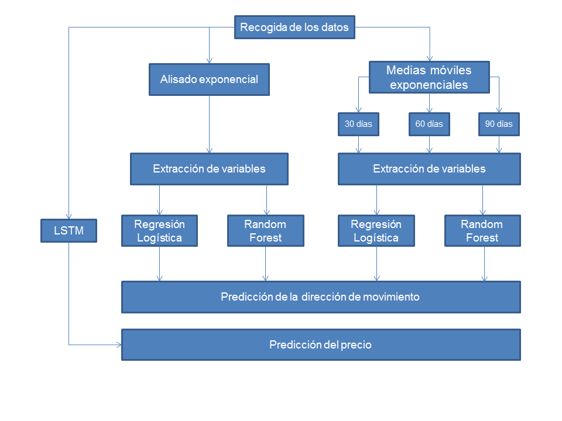

\justifying

En primer lugar, la metodología que va a seguir el presente trabajo en cuanto al análisis económico del marco teórico actual es el siguiente: en primer lugar se aborda la evolución histórica de la inteligencia artificial, poniendo especial atención en las aplicaciones financieras creadas durante el desarrollo de este campo de estudio. En segundo lugar, (revisar) use case y consecuencias asociadas a los mismos. En tercer lugar consecuencias micro, macro

La metodología que se va a seguir en el presente trabajo es la siguiente:

\centering

\centering
  \captionof{figure}{Metodología propuesta}
  
\justifying
